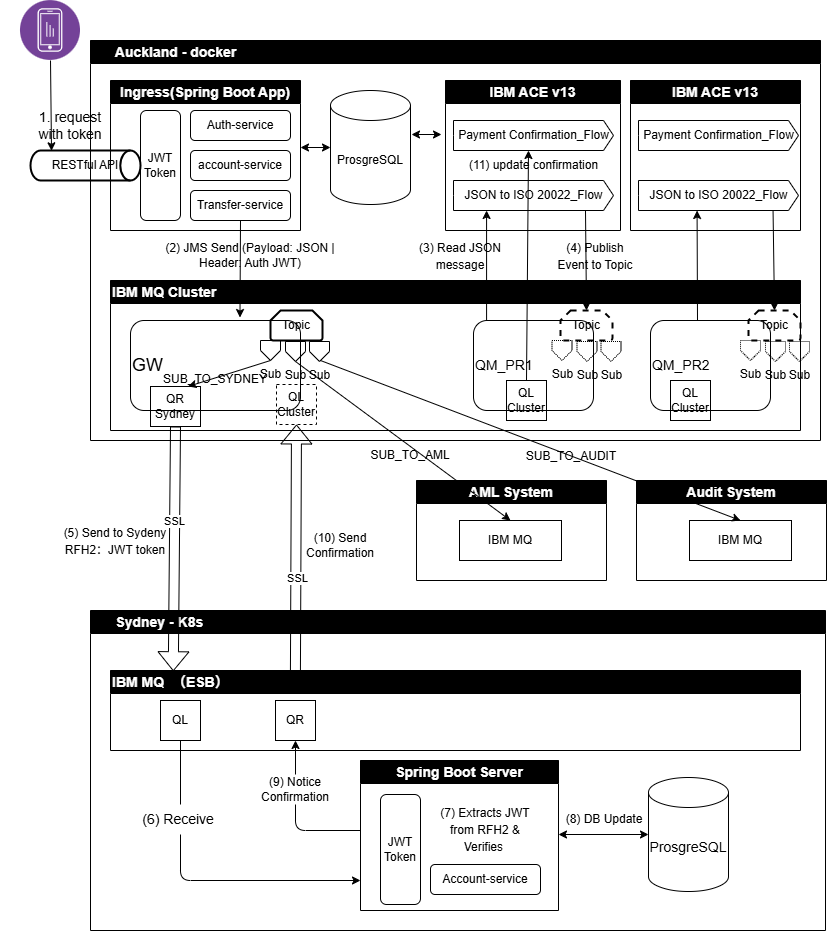
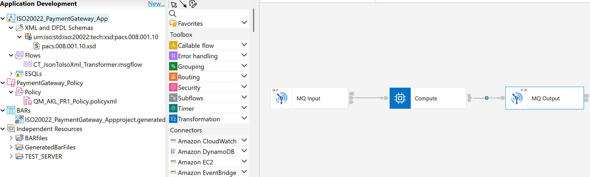

# 🌏 Cross-Tasman ISO 20022 Payment Hub
### Enterprise Hybrid Integration Platform (IBM ACE v13, IBM MQ 9.4 & Spring Boot)
> A cloud-native, event-driven payment integration gateway modernizing cross-border interbank settlement with IBM ACE/MQ, containerized on Docker/K8s.

This repository showcases a **production-ready, bank-grade integration solution** simulating a real-world cross-border payment routing gateway between New Zealand (Auckland) and Australia (Sydney). It demonstrates the seamless modernization of legacy banking integration stacks by marrying traditional **IBM MQ Clustered Messaging & App Connect Enterprise (ACE) v13** with modern **Cloud-Native Containerization, Spring Boot Microservices, OAuth2/JWT security, and Event-Driven Pub-Sub architectures**.

---

## Architectural Topology & Message Flow



## 📑 Table of Contents
* [Dual-Tier Security Architecture](#-dual-tier-security-architecture--token-flow)
  * [1. End-to-End Authentication Flow](#1-end-to-end-authentication--security-flow)
  * [2. Tier 1: Local Microservice Auth (HS256)](#2-tier-1-local-microservice-auth-hs256-in-spring-boot)
  * [3. Tier 2: Cross-Tasman Zero-Trust Transit (RS256)](#3-tier-2-cross-tasman-zero-trust-transit-rs256-asymmetric-cryptography)
* [Hybrid ESB Architecture & Clustered Messaging Fabric](#️-hybrid-esb-architecture--clustered-messaging-fabric)
  * [1. MQ Cluster Topology & Workload Balancing](#1-mq-cluster-topology--workload-balancing)
  * [2. ESQL Transformation Pipeline (JSON to ISO 20022 XML)](#2-esql-transformation-pipeline-json-to-iso-20022-xml)
  * [3. Topic-Based Pub-Sub & 1-to-3 Fan-Out Routing](#3-topic-based-pub-sub--1-to-3-fan-out-routing)
* [Local Deployment & Verification](#-local-deployment--verification)

---

## 1. Security Architecture with JWT Token Strategy & TLS/SSL Channel Encryption

The payment hub implements a **Defense-in-Depth** security strategy, combining application-layer signature verification with transport-layer cryptographic channels:

* **Hybrid JWT Security Paradigm**: The platform adopts a **Hybrid HS256 + RS256 JWT Token Strategy** to enable high-throughput authentication for internal microservices while enforcing non-repudiation and zero-trust offline verification for cross-border transactions.
* **Transport-Layer Channel Hardening (mTLS)**: Inter-regional MQ communication bridging Auckland (`QM_AKL_GW`) and Sydney (`QM_SYD`) is secured over dedicated **TLS/SSL channels (CipherSpec over TCP 31414)**, preventing eavesdropping and man-in-the-middle (MITM) attacks during cross-sea transit.
---

### 1.1 Security Flow

```
[Client / Mobile App]
       │
       ▼ (1) REST Request (Header: HS256 Bearer JWT)
[Auckland Ingress - Spring Boot]
       │  ├── Validates client identity via local HMAC secret (HS256)
       │  └── Generates high-assurance RS256 JWT signed with Auckland Private Key
       │
       ▼ (2) JMS Send (Payload: JSON | RFH2.usr: Token-RS256)
[IBM MQ Auckland Cluster]
       │
       ▼ (3) Read & (4) Publish to Topic (Preserves RFH2.usr Token-RS256)
[IBM ACE v13 (ESQL Engine)]
       │
       ▼ (5) Cross-Border Sender Channel (mTLS / CipherSpec Encrypted over TCP 31414)
[Sydney K8s Cluster - IBM MQ]
       │
       ▼ (6) Inbound Message Delivery (Local Queue)
[Sydney Receiver - Spring Boot]
       │  ├── Extracts RS256 Token from MQRFH2.usr header
       │  ├── Offline Verification using local Auckland Public Key (Zero network overhead)
       │  ├── Executes Account Credit & Ledger Update (PostgreSQL)
       │  └── Generates ISO 20022 pacs.002 Confirmation ACK
       │
       ▼ (7) Async Return Transit (mTLS Encrypted Channel)
[Auckland Ingress / ACE (Saga Closed)]
```

---

### 1.2 Auckland Local Microservice Auth (HS256 in Spring Boot)

* **Algorithm**: HMAC with SHA-256 (Symmetric Encryption).
* **Use Case**: High-performance, low-latency authentication between client gateways and local Spring Boot microservices inside the Auckland trust domain.

**Spring Boot Configuration (`application.properties`)**

```properties
# Security Configuration for JWT
# This is a 256-bit safe Base64 encoded security key
app.jwt.secret=dGhpcy1pcy1hLXZlcnktc2VjdXJlLTI1Ni1iaXQtc2VjcmV0LWtleS1mb3ItZGVtb25zdHJhdGlvbg==
app.jwt.expiration-ms=86400000

```

**Spring Boot JWT Generation & Validation**

```java
// Signing Token with HS256
SecretKey key = Keys.hmacShaKeyFor(secretKey.getBytes(StandardCharsets.UTF_8));
String jwt = Jwts.builder()
        .subject(userId)
        .claim("scope", "payment:initiate")
        .issuedAt(new Date())
        .expiration(new Date(System.currentTimeMillis() + expirationMs))
        .signWith(key)
        .compact();

```

---

### 1.3 Sydney Cross-Tasman Zero-Trust Transit (RS256 Asymmetric Cryptography)

* **Algorithm**: RSA Signature with SHA-256 (Asymmetric Encryption).
* **Use Case**: The payload travels across untrusted inter-regional boundaries. Sydney verifies transaction authenticity **offline** using the public key, eliminating cross-border RPC calls or token-validation endpoints.

**RSA Keypair Generation Commands (OpenSSL)**

```bash
# 1. Generate Auckland Private Key (Kept strictly on Auckland Ingress Server)
openssl genpkey -algorithm RSA -out auckland_private_key.pem -pkeyopt rsa_keygen_bits:2048

# 2. Extract Public Key in PKCS#8 format (Distributed to Sydney Receiver)
openssl rsa -in auckland_private_key.pem -pubout -out sydney_public_key.pem

# 3. Convert Private Key to PKCS#8 format (for Spring Boot ingestion)
openssl pkcs8 -topk8 -inform PEM -outform PEM -in auckland_private_key.pem -out auckland_private_key_pkcs8.pem -nocrypt

```

**Token Handling in JMS & ACE Pipeline**

* **Auckland Ingress (Spring Boot)**: Injects the signed RS256 token into the JMS custom user header (`MQRFH2.usr`):
```java
jmsTemplate.send("PAYMENT.INITIATED.QUEUE", session -> {
    TextMessage message = session.createTextMessage(jsonPayload);
    message.setStringProperty("Auth_JWT", rs256SignedToken); // Injected into MQRFH2.usr
    return message;
});
```


* **IBM ACE v13 Integration Node**: Preserves the token intact during message cleansing and ESQL translation into ISO 20022 XML:
```sql
-- Preserve RS256 token in MQRFH2 header while transforming payload body
SET OutputRoot.MQRFH2.usr.Auth_JWT = InputRoot.MQRFH2.usr.Auth_JWT;
```


* **Sydney Receiver (Spring Boot)**: Extracts `MQRFH2.usr.Auth_JWT` and performs offline cryptographic verification using `sydney_public_key.pem` before updating the local ledger.


## 2. Hybrid ESB Architecture & Clustered Messaging Fabric

In modern enterprise integration terminology, **IBM ACE acts as the Integration Engine / ESB Transformation Layer** (mediating, parsing, transforming), while **IBM MQ functions as the Distributed Enterprise Messaging Backbone** (reliable transport, asynchronous decoupling, and clustering). Together, they form a resilient, production-grade **Hybrid ESB Platform**.

---

### 2.1 MQ Cluster Topology & Workload Balancing

The Auckland regional domain runs an **Active-Active IBM MQ 9.4 Cluster** structured with high availability and dynamic workload routing:

```
                     [ Spring Boot Ingress ]
                                │
                         ▼ (JMS/TLS)
                ┌─────────────────────────────────┐
                │     QM_AKL_GW                   │
                └───────────────┬─────────────────┘
                                │(Workload Balancing)
                  ┌─────────────┴─────────────┐ 
                  ▼                           ▼
      ┌─────────────────────────┐     ┌─────────────────────────┐
      │ QM_AKL_PR1              │     │ QM_AKL_PR2              │
      │ • Cluster Queue (Local) │     │ • Cluster Queue (Local) │
      └────────────┬────────────┘     └────────────┬────────────┘
                   │                               │
                   ▼                               ▼
         [ ACE Server Node 1 ]           [ ACE Server Node 2 ]
      (Additional Instances: 10)      (Additional Instances: 10)

```

---

### 2.2 ESQL Transformation Pipeline (JSON to ISO 20022 XML)

The ACE message flow (`JSON_to_ISO20022_Flow`) executes zero-loss data cleansing and protocol translation:

* **Payload Cleansing**: Parses incoming JSON and maps it into high-performance `XMLNSC` tree structures complying with SWIFT `pacs.008.001.10`.
* **Header & Security Propagation**: Carries forward `MQRFH2.usr.Token-RS256` into the target message context.
* **Encoding & Code Page Locking**: Forces `1208` (UTF-8) character encoding to prevent cross-platform character corruption during transit.

---

### 2.3 Topic-Based Pub-Sub & 1-to-3 Fan-Out Routing

Once transformation completes, ACE publishes the ISO 20022 XML message to the central topic **`Payment/CrossBorder/Initiated`**. The IBM MQ Pub/Sub Engine instantly forks the payload into 3 independent subscriptions, fully isolating core settlement from auxiliary auditing and compliance pipelines:
```
             [ IBM ACE v13 Transformation Flow ]
                             │
                             ▼ (Publish)
              [ Topic: Payment/CrossBorder/Initiated ]
                             │
    ┌────────────────────────┼────────────────────────┐
    ▼                        ▼                        ▼
[ Subscription 1 ]       [ Subscription 2 ]       [ Subscription 3 ]
(SUB_TO_SYDNEY)          (SUB_TO_AUDIT)           (SUB_TO_AML)
    │                        │                        │
    ▼                        ▼                        ▼
[ QALIAS / QR ]           [ QREMOTE ]              [ QREMOTE ]
PAYMENT.TO.SYDNEY        PAYMENT.AUDIT.OUT        PAYMENT.AML.OUT
    │                        │                        │
    ▼ (SDR/RCVR TLS)         ▼ (Dedicated Sender)     ▼ (Dedicated Sender)
[ QM_SYD (Sydney) ]     [ Audit Remote Host ]    [ AML Scoring Host ]

```

* **Core Settlement (`SUB_TO_SYDNEY`)**: Resolves to a Remote Queue Definition (`QR`) that binds to the physical cross-sea Sender-Receiver channel (`QM_AKL_GW -> QM_SYD`) over TCP/TLS port 31414.
* **Compliance & AML Scoring (`SUB_TO_AML`)**: Asynchronously routes a replicated copy to the dedicated Anti-Money Laundering engine via Remote Queue, ensuring transaction evaluation occurs without blocking core processing.
* **Regulatory Audit Trail (`SUB_TO_AUDIT`)**: Delivers an immutable record to the Audit System queue for ingestion into the enterprise log archive (ELK / Splunk).

```


### 2. Event-Driven Architecture (EDA) & Publish-Subscribe Fan-out
Instead of tight point-to-point queue bindings, the Auckland ACE engine issues events to a logic topic: `Payment/CrossBorder/Initiated`. Within IBM MQ, we configure a **3-way Pub-Sub subscription cluster**:
*   **Core Business Pathway (`SUB_TO_SYDNEY`)**: Listens to the topic and routes messages to an Alias Queue (`PAYMENT.TO.SYDNEY.ALIAS`), which is linked to a Clustered Remote Queue (`PAYMENT.CROSSBORDER.OUT`) bound for Australia.
*   **Compliance Pipeline (`SUB_TO_AML`)**: Intercepts payment records simultaneously, routing them to `PAYMENT.AML.Q` for real-time compliance check by a rule engine.
*   **Audit Pipeline (`SUB_TO_AUDIT`)**: Replicates raw payloads into `PAYMENT.AUDIT.Q` for indexing in ELK (Elasticsearch, Logstash, Kibana) without adding latency to the payment pipeline.

### 3. Active-Active IBM MQ & ACE High-Availability Cluster
*   **MQ Clustered Repository Layout**: Auckland utilizes `QM_AKL_FR` as a Full Repository (Gateway) and `QM_AKL_PR1`/`QM_AKL_PR2` as Partial Repositories. Ingress Spring Boot traffic is dynamically balanced across PR1 and PR2.
*   **Automatic Workload Routing**: If `PR1` fails, traffic is automatically routed to `PR2`. If the remote link to Sydney is disrupted, MQ automatically queues messages on the Auckland Gateway transmission queue (`XMITQ`), guaranteeing **Zero-Data-Loss**.
*   **Poison Message Handling**: Configured with a dedicated Backout Queue (`PAYMENT.CLUSTER.IN.BOQ`) and a threshold of `3`. Problematic messages are gracefully isolated to prevent MQ consumer starvation.

### 4. Zero-Plaintext Secret Management (`mqsivault` & Policies)
Aligned with bank-grade security audits (e.g., PCI-DSS):
*   ACE integration nodes use an encrypted vault (`config/vault`) to store database and MQ credentials.
*   Instead of hardcoding connection strings and passwords inside the BAR file, we implement decoupled **`MQConnection` Policies** (`MqAklPolicy.policyxml`).
*   Passwords are encrypted in local JSON descriptors (`bXEvYWtsTXFBdXRo.json`) and decrypted in-memory inside the Docker container during startup using the `MQSI_VAULT_KEY` environment variable.


