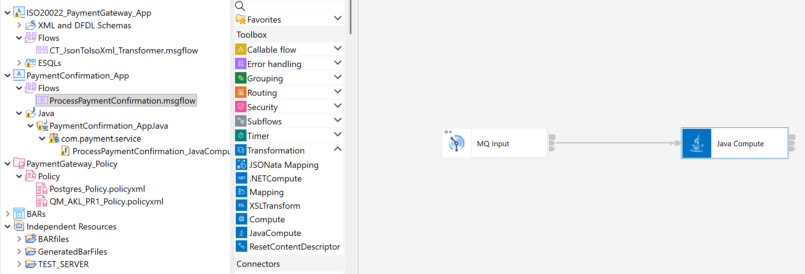
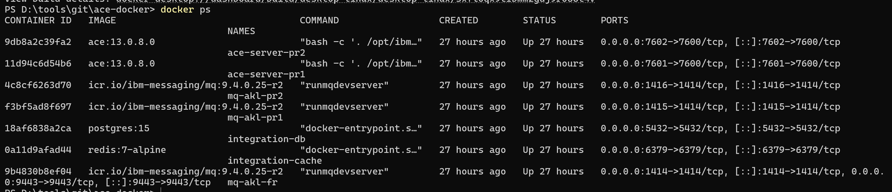

# 🌏 Cross-Tasman ISO 20022 Payment Hub
### Enterprise Hybrid Integration Platform (IBM ACE v13, IBM MQ 9.4 & Spring Boot)
> A cloud-native, event-driven payment integration gateway modernizing cross-border interbank settlement with IBM ACE/MQ, containerized on Docker/K8s.

This repository showcases a **production-ready, bank-grade integration solution** simulating a real-world cross-border payment routing gateway between New Zealand (Auckland) and Australia (Sydney). It demonstrates the seamless modernization of legacy banking integration stacks by marrying traditional **IBM MQ Clustered Messaging & App Connect Enterprise (ACE) v13** with modern **Cloud-Native Containerization, Spring Boot Microservices, OAuth2/JWT security, and Event-Driven Pub-Sub architectures**.

---

## Architectural Overview & Message Flow


## Table of Contents
* [1. JWT-Based Security](#1-jwt-based-security)
  * [1.1 Security Flow](#11-security-flow)
  * [1.2 Tier 1: Local Microservice Auth (HS256)](#12-local-microservice-auth-hs256)
  * [1.3 Tier 2: Sydney Zero-Trust Transit (RS256)](#13-sydney-zero-trust-transit-rs256)
* [2. Hybrid ESB Architecture (IBM ACE & MQ)](#2-hybrid-esb-architecture-ibm-ace--mq)
  * [2.1 MQ Cluster Architecture in Auckland](#21-mq-cluster-architecture-in-auckland)
  * [2.2 ACE Message Flow](#22-ace-message-flow)
  * [2.3 Topic-Based Pub-Sub & 1-to-3 Fan-Out Routing](#23-topic-based-pub-sub--1-to-3-fan-out-routing)
* [3. Hybrid Cloud-Native Deployment (Docker & Kubernetes)](#3-hybrid-cloud-native-deployment-docker--kubernetes)
  * [3.1 Auckland Region: Multi-Container Stack (Docker Compose)](#31-auckland-region-multi-container-stack-docker-compose)
  * [3.2 Sydney Region: Enterprise Cloud-Native Pods (Kubernetes)](#32-sydney-region-enterprise-cloud-native-pods-kubernetes)
* [Local Deployment & Verification](#-local-deployment--verification)

---

## 1. JWT-Based Security

The payment hub implements a **Defense-in-Depth** security strategy, combining application-layer signature verification with transport-layer cryptographic channels:

* **Hybrid JWT Security Paradigm**: The platform adopts a **Hybrid HS256 + RS256 JWT Token Strategy** to enable high-throughput authentication for internal microservices while enforcing non-repudiation and zero-trust offline verification for cross-border transactions.
* **Transport-Layer Channel Hardening (mTLS)**: Inter-regional MQ communication bridging Auckland (`QM_AKL_GW`) and Sydney (`QM_SYD`) is secured over dedicated **TLS/SSL channels (CipherSpec over TCP 31414)**, preventing eavesdropping and man-in-the-middle (MITM) attacks during cross-sea transit.
---

### 1.1 Security Flow

```
[Client / Mobile App]
       │
       ▼ (1) REST Request (Header: HS256 Bearer JWT)
[Auckland Ingress - Spring Boot]
       │  ├── Validates client identity via local HMAC secret (HS256)
       │  └── Generates high-assurance RS256 JWT signed with Auckland Private Key
       │
       ▼ (2) JMS Send (Payload: JSON | RFH2.usr: Token-RS256)
[IBM MQ Auckland Cluster]
       │
       ▼ (3) Read & (4) Publish to Topic (Preserves RFH2.usr Token-RS256)
[IBM ACE v13 (ESQL Engine)]
       │
       ▼ (5) Cross-Border Sender Channel (mTLS / CipherSpec Encrypted over TCP 31414)
[Sydney K8s Cluster - IBM MQ]
       │
       ▼ (6) Inbound Message Delivery (Local Queue)
[Sydney Receiver - Spring Boot]
       │  ├── Extracts RS256 Token from MQRFH2.usr header
       │  ├── Offline Verification using local Auckland Public Key (Zero network overhead)
       │  ├── Executes Account Credit & Ledger Update (PostgreSQL)
       │  └── Generates ISO 20022 pacs.002 Confirmation ACK
       │
       ▼ (7) Async Return Transit (mTLS Encrypted Channel)
[Auckland Ingress / ACE (Saga Closed)]
```

---

### 1.2 Local Microservice Auth (HS256)

* **Algorithm**: HMAC with SHA-256 (Symmetric Encryption).
* **Use Case**: High-performance, low-latency authentication between client gateways and local Spring Boot microservices inside the Auckland trust domain.

**Spring Boot Configuration (`application.properties`)**

```properties
# Security Configuration for JWT
# This is a 256-bit safe Base64 encoded security key
app.jwt.secret=dGhpcy1pcy1hLXZlcnktc2VjdXJlLTI1Ni1iaXQtc2VjcmV0LWtleS1mb3ItZGVtb25zdHJhdGlvbg==
app.jwt.expiration-ms=86400000

```

**Spring Boot JWT Generation & Validation**

```java
// Signing Token with HS256
SecretKey key = Keys.hmacShaKeyFor(secretKey.getBytes(StandardCharsets.UTF_8));
String jwt = Jwts.builder()
        .subject(userId)
        .claim("scope", "payment:initiate")
        .issuedAt(new Date())
        .expiration(new Date(System.currentTimeMillis() + expirationMs))
        .signWith(key)
        .compact();

```

---

### 1.3 Sydney Zero-Trust Transit (RS256)

* **Algorithm**: RSA Signature with SHA-256 (Asymmetric Encryption).
* **Use Case**: The payload travels across untrusted inter-regional boundaries. Sydney verifies transaction authenticity **offline** using the public key, eliminating cross-border RPC calls or token-validation endpoints.

**RSA Keypair Generation Commands (OpenSSL)**

```bash
# 1. Generate Auckland Private Key (Kept strictly on Auckland Ingress Server)
openssl genpkey -algorithm RSA -out auckland_private_key.pem -pkeyopt rsa_keygen_bits:2048

# 2. Extract Public Key in PKCS#8 format (Distributed to Sydney Receiver)
openssl rsa -in auckland_private_key.pem -pubout -out sydney_public_key.pem

# 3. Convert Private Key to PKCS#8 format (for Spring Boot ingestion)
openssl pkcs8 -topk8 -inform PEM -outform PEM -in auckland_private_key.pem -out auckland_private_key_pkcs8.pem -nocrypt

```

**Token Handling in JMS & ACE Pipeline**

* **Auckland Ingress (Spring Boot)**: Injects the signed RS256 token into the JMS custom user header (`MQRFH2.usr`):
```java
jmsTemplate.send("PAYMENT.INITIATED.QUEUE", session -> {
    TextMessage message = session.createTextMessage(jsonPayload);
    message.setStringProperty("Auth_JWT", rs256SignedToken); // Injected into MQRFH2.usr
    return message;
});
```

* **IBM ACE v13 Integration Node**: Preserves the token intact during message cleansing and ESQL translation into ISO 20022 XML:
```sql
-- Preserve RS256 token in MQRFH2 header while transforming payload body
SET OutputRoot.MQRFH2.usr.Auth_JWT = InputRoot.MQRFH2.usr.Auth_JWT;
```

* **Sydney Receiver (Spring Boot)**: Extracts `MQRFH2.usr.Auth_JWT` and performs offline cryptographic verification using `sydney_public_key.pem` before updating the local ledger.


## 2. Hybrid ESB Architecture (IBM ACE & MQ)

This platform adopts an enterprise-grade **IBM ACE + IBM MQ Hybrid ESB pattern**, establishing a strict separation of concerns between **data transformation / business mediation** and **reliable transport / distributed clustering**:
* **IBM ACE (App Connect Enterprise v13) — Integration & Transformation Engine**:
  Acts as the intelligent processing core. It handles complex message format transformation (e.g., transforming REST/JSON payloads into canonical ISO 20022 XML `pacs.008`), business rule validation, message cleansing, RFH2 security header preservation, and topic publication.
* **IBM MQ (v9.4) — Distributed Enterprise Messaging Backbone**:
  Functions as the high-throughput, transactional messaging fabric. It provides Active-Active clustered workload balancing, guaranteed Once-and-Only-Once message delivery, resilient cross-border mTLS transmission channels, and dynamic 1-to-3 Topic Pub/Sub fan-out (decoupling core settlement from AML compliance and audit pipelines).
---

### 2.1 MQ Cluster Architecture in Auckland

The Auckland regional domain implements an **Active-Active IBM MQ 9.4 Cluster (`AKL_CLUSTER`)**, establishing a clean topological separation between **External Gateway Communication** and **Internal Business Processing**:

* **Gateway & Full Repository (`QM_AKL_FR`)**:
  * **External Edge Gateway**: Serves as the centralized inbound/outbound communication hub for Auckland, managing traffic with external domains — including cross-border transit to Sydney (`QM_SYD`), compliance AML scoring hosts, and regulatory audit archives.
  * **Dynamic Workload Router**: Operates as the Full Repository (FR) maintaining cluster topology. It exposes the entry alias `PAYMENT.TX.INBOUND` configured with `DEFBIND(NOTFIXED)` to dynamically round-robin incoming payment traffic across the worker nodes on a per-message basis.
* **Business Worker Nodes & Partial Repositories (`QM_AKL_PR1` & `QM_AKL_PR2`)**:
  * **Parallel Clustered Processing**: Act as Partial Repositories (PR) hosting the physical local cluster queues (`PAYMENT.CLUSTER.IN`) to consume workload dispatched by the gateway.
  * **Dedicated ACE Engine Pairing**: Each PR node is coupled with a dedicated containerized **IBM ACE v13 Server** (`ace-server-pr1` / `ace-server-pr2`) to execute message parsing, format transformation, and business validation in parallel with zero-downtime failover capability.

```
                     [ Spring Boot Ingress ]
                                │
                         ▼ (JMS/TLS)
                ┌─────────────────────────────────┐
                │   QM_AKL_FR (Gateway / FR)      │
                └───────────────┬─────────────────┘
                                │(Workload Balancing)
                  ┌─────────────┴─────────────┐ 
                  ▼                           ▼
      ┌─────────────────────────┐     ┌─────────────────────────┐
      │ QM_AKL_PR1 (Worker/PR)  │     │ QM_AKL_PR2 (Worker/PR)  │
      │ • Cluster Queue (Local) │     │ • Cluster Queue (Local) │
      └────────────┬────────────┘     └────────────┬────────────┘
                   │                               │
                   ▼                               ▼
         [ ACE Server PR1 ]              [ ACE Server PR2 ]
      (Additional Instances: 10)      (Additional Instances: 10)

```
---

### 2.2 ACE Message Flow

The core transformation and mediation logic is hosted inside containerized **IBM App Connect Enterprise (ACE) v13** nodes. It processes incoming JSON payment requests, enriches and transforms them into standard **ISO 20022 `pacs.008.001.10` XML**, and publishes them to the MQ Pub-Sub topic tree.



#### 1. End-to-End Flow Pipeline
* **Inbound Consumption (`MQ Input`)**: Reads JSON payment messages dispatched by the Auckland MQ cluster (`PAYMENT.CLUSTER.IN`).
* **ISO 20022 Transformation & Sanitization (`Compute Node`)**:
  * **Schema Conformance**: Maps JSON payload fields into canonical **`pacs.008.001.10.xsd`** structure (`FIToFICstmrCdtTrf`, `GrpHdr`, `CdtTrfTxInf`, BIC identifiers).
  * **Zero-Trust Security Preservation**: Extracts the RS256 JWT signature from the ingress request and preserves it inside `MQRFH2.usr.Auth_JWT` for downstream Sydney verification.
  * **Character Set Normalization**: Enforces strict UTF-8 (`CCSID 1208`) across `MQMD` and `XMLNSC` domain properties to ensure cross-platform consistency.
* **Topic Publication (`MQ Publication`)**: Emits the validated ISO 20022 XML payload to topic **`Payment/CrossBorder/Initiated`** for multi-consumer distribution.

#### 2. Cloud-Native Decoupling via Policies (`policyType="MQEndpoint"`)
* **Environment-Agnostic (`.bar`) Build**: The compiled application BAR contains zero hardcoded hostnames, ports, or credentials, adhering to 12-factor cloud principles.
* **Dynamic Runtime Binding**: Target MQ connectivity is resolved dynamically via **`MQEndpoint` Policy files** (`QM_AKL_PR1_Policy.policyxml` / `QM_AKL_PR2_Policy.policyxml`).
* **Containerized Deployment**: The identical `.bar` file is deployed to both `ace-server-pr1` and `ace-server-pr2` containers; distinct policies are dynamically volume-mounted (`./ace-policies/pr1` and `./ace-policies/pr2`) to establish connection to respective Partial Repositories.
* **Encrypted Secret Management**: MQ credentials (`securityIdentity: aklMqAuth`) are decrypted strictly in-memory via `mqsivault` using runtime environment keys (`MQSI_VAULT_KEY`).

---

### 2.3 Topic-Based Pub-Sub & 1-to-3 Fan-Out Routing

Once transformation completes, ACE publishes the ISO 20022 XML payload to the central MQ topic **`Payment/CrossBorder/Initiated`**. The IBM MQ Pub/Sub Engine instantly executes a **1-to-3 Fan-Out distribution**, fully decoupling real-time settlement from compliance and audit streaming:

```
             [ IBM ACE v13 Transformation Flow ]
                             │
                             ▼ (Publish ISO 20022 XML)
              [ Topic: Payment/CrossBorder/Initiated ]
                             │
    ┌────────────────────────┼────────────────────────┐
    ▼                        ▼                        ▼
[ Subscription 1 ]       [ Subscription 2 ]       [ Subscription 3 ]
 (SUB_TO_SYDNEY)          (SUB_TO_AUDIT)           (SUB_TO_AML)
    │                        │                        │
    ▼                        ▼                        ▼
[ QALIAS / QR ]           [ QREMOTE ]              [ QREMOTE ]
PAYMENT.TO.SYDNEY        PAYMENT.AUDIT.OUT        PAYMENT.AML.OUT
    │                        │                        │
    ▼ (mTLS SDR/RCVR Channel)▼ (Dedicated Sender)     ▼ (Dedicated Sender)
[ QM_SYD (Sydney) ]     [ Audit System ]         [ AML Scoring Engine ]
```

#### Key Architectural Benefits
* **Core Settlement (`SUB_TO_SYDNEY`)**: Resolves to a Remote Queue Definition (`QR`) routed across a dedicated cross-sea **mTLS Sender-Receiver Channel (`QM_AKL_FR -> QM_SYD`)** over TCP port 31414.
* **Non-Blocking AML Compliance (`SUB_TO_AML`)**: Asynchronously feeds transactions into the Anti-Money Laundering scoring engine. Even under high AML processing latency or scheduled maintenance downtime, core interbank settlement continues unimpeded.
* **Immutable Audit Trail (`SUB_TO_AUDIT`)**: Streams transaction records directly into enterprise log archives (Splunk / ELK) for banking regulatory compliance.
* **Zero-Impact Extensibility**: New consumers (such as Real-Time Fraud Detection or FX Rate Analytics) can be attached purely through new MQ subscription definitions without modifying existing ACE message flows.

---

## 3. Hybrid Cloud-Native Deployment (Docker & Kubernetes)

The platform demonstrates a realistic **Hybrid Multi-Region deployment model**, bridging an on-premises / edge-like multi-container environment in **Auckland (Docker Compose)** with a cloud-native enterprise cluster in **Sydney (Kubernetes)**.

### 3.1 Auckland Region: Multi-Container Stack (Docker Compose)

The Auckland domain is fully containerized via `docker-compose.yml` on a dedicated bridge network (`akl-cluster-net`), providing an active-active integration topology:

* **Active-Active MQ Cluster**: Deploys 3 distinct queue managers (`mq-akl-fr`, `mq-akl-pr1`, `mq-akl-pr2`) to simulate enterprise clustering and workload balancing.
* **Dual ACE Integration Servers**: Runs `ace-server-pr1` and `ace-server-pr2` (IBM ACE v13), dynamically mounting policies (`./ace-policies/pr1` & `./ace-policies/pr2`) and compiled BAR files.
* **Ledger & Cache Tier**: Houses `PostgreSQL 15` for local transaction journals and `Redis 7` for ultra-low latency cache checks.

---

### 3.2 Sydney Region: Enterprise Cloud-Native Pods (Kubernetes)

The Sydney domain models a bank-grade production cloud environment managed declaratively via Kubernetes manifests (`syd-mq-k8s.yaml`):

* **Isolated Namespace (`payment-hub`)**: Enforces multi-tenant resource boundaries and security policies.
* **Stateful Resilience (PV / PVC)**: Binds a `5Gi` PersistentVolume to `/var/mqm` to ensure zero message loss across Pod evictions or rolling restarts.
* **GitOps Configuration (`ConfigMap`)**: Injects `syd.mqsc` declaratively into the MQ container at startup, eliminating manual configuration drift.
* **Cross-Border Service Exposure (`NodePort / LoadBalancer`)**: Exposes MQ listener port `1414` externally as NodePort `31414` (and Web Console as `31443`), enabling secure mTLS ingress from Auckland.
